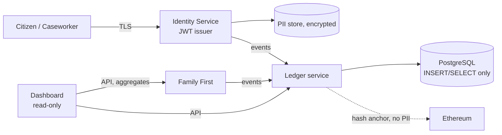

# Data Flow and Authorization Boundary

```mermaid
flowchart LR
  U[Citizen / Caseworker] -->|TLS| ID[Identity Service<br/>JWT issuer]
  ID --> PII[(PII store, encrypted)]
  FF[Family First] -->|events| L[Ledger service]
  ID -->|events| L
  L --> DB[(PostgreSQL<br/>INSERT/SELECT only)]
  L -. hash anchor, no PII .-> ETH[Ethereum]
  D[Dashboard<br/>read-only] -->|API, aggregates| FF
  D -->|API| L
```

Boundary: all services and databases above except Ethereum (external). Only the Ledger service writes ledger records. The dashboard has no direct DB access.
